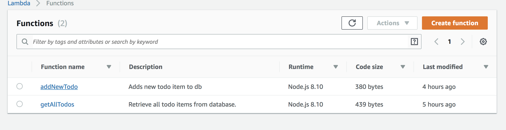
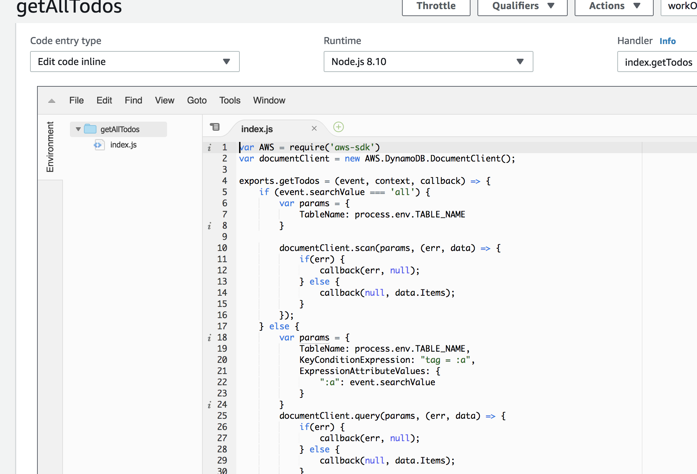
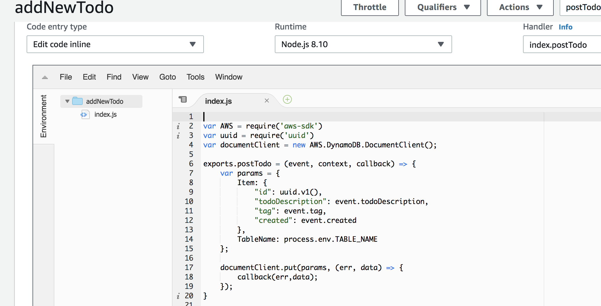

# Simple Note Taking App

The objective of this code challenge was to create a simple note taking app (ToDo List).

#### Expected Functionality:
  - Allow input of new ToDo Item, max of 250 characters, with dropdown menu of tags: work, personal, and hobby.
  - View of all previously created ToDo Items.
  - Ability to filter items by tag and by date.

#### Technology
  **Front End**
  - HTML
  - CSS
  - ES6
  - JQuery

  **Back End**
  - AWS API Gateway
  - AWS Lambda
  - AWS DynamoDB

#### Cloning

  Simply fork and clone this repo and you'll be ready to go!

#### Reflection of Work

This was my first time accessing AWS and playing around with the tools they offer.  Through the provided tutorials and my own AWS documentation reading, I was able to implement the AWS API Gateway, Lambda functions, and DynamoDB on my back end. This was definitely challenging, but AWS is well documented and there are plenty of resources to comb through.

For the tag-filter, I decided to do this on the back end to push more of the computational logic to the database as opposed to doing it on the client browser. This was achieved by performing different queries on DynamoDB via the lambda function.

On the front end, I went with a fairly simple layout and used JQuery to easily manipulate the DOM.

**Known Issues**

Currently, the sort by date functionality puts the items in order from least to most recent. In future iterations, I'd rather this be a sort option where no matter which filter you're on (tag), you can have the option to then sort by date.

The lambda code in this repo was copied and pasted from my AWS Lambda Console and is for display purposes only.

### Live App Usage

### AWS Services Used

Since I cannot provide you access to my AWS account, I have included screenshots showing the DynamoDB Console, API Gateway Console, and Lambda pages I used.

**DynamoDB Console**

**API Gateway Console**

**Lambda Console**

